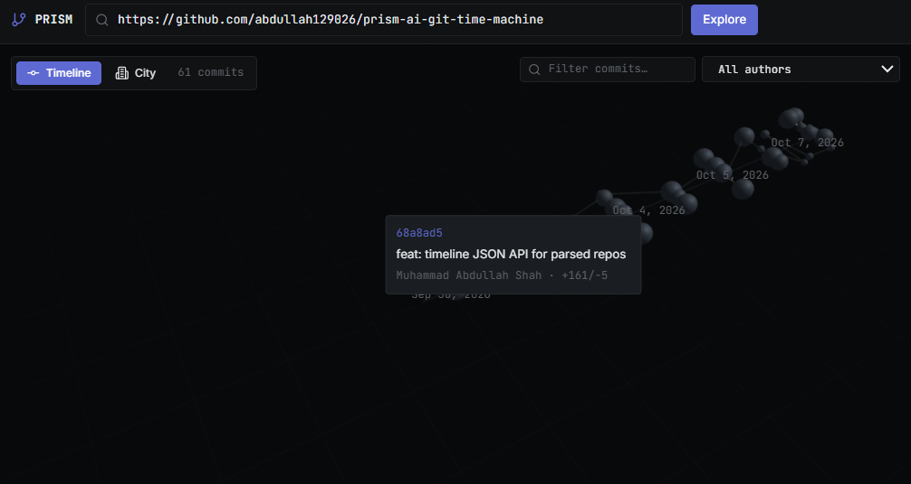

# PRISM — AI-Powered Git Time Machine

**Live demo:** https://www.fluxyai.codes · **API:** https://api.fluxyai.codes

`git log` tells you *what* changed. PRISM tells you *why*.

Paste in any public repo URL and PRISM clones its history, then an LLM explains
each commit: why it happened, what bug it fixed, what risk it introduced. You
explore it on a 3D timeline (commits are nodes, files are buildings) or a flat
2D view on small screens.



## What it does

- **Commit intent, explained** — per-commit *why*, *what broke*, *what's risky*,
  generated from the raw diff by an LLM
- **3D timeline + file city** — fly through history; buildings are files sized
  by churn. Click a building to jump to the newest commit touching that file
- **Conflict prediction** — AST-level overlap analysis (Tree-sitter) across
  branches, *before* you merge
- **Semantic ownership** — who actually understands the code, weighted by recent
  well-understood changes. Not `git blame`
- **Keyboard-first** — `⌘K` command palette, `/` to filter, arrow keys to walk
  commits, `Esc` to deselect

## Stack

| Layer    | Tech |
|----------|------|
| Frontend | Next.js, React Three Fiber, TypeScript |
| Backend  | FastAPI, GitPython, Tree-sitter |
| AI       | Groq (LLM inference), Qdrant (semantic code search) |
| Deploy   | Vercel (frontend), Render (backend, Docker) |

## Security

This API ingests arbitrary public repos, so it's built like it:

- Repo URLs restricted to public `http(s)` — SSRF probes and `file://`,
  ssh, and local paths are rejected by default
- Per-IP rate limits on the expensive endpoints (cloning, AI analysis)
- Prompt-injection hardening: raw commit content is fenced as untrusted data,
  never instructions, in every LLM call
- Shallow clones capped at the parsed commit depth — a giant repo can't fill
  the disk
- Dependencies pinned and audited in CI (`pip-audit` blocking, `npm audit`
  report-only)

## Run it yourself

```bash
# backend
cd backend
pip install -r requirements.txt
uvicorn app.main:app --reload

# frontend
cd frontend
npm install
npm run dev
```

Or with Docker:

```bash
docker compose up --build
```

Set `PRISM_GROQ_API_KEY` for commit-intent analysis. `PRISM_DEMO_REPO`
pre-loads a demo repository on startup. `PRISM_ALLOW_LOCAL_REPOS=true`
re-enables `file://`/ssh/local repo URLs for self-hosting.

## Deployment

The live deployment runs on a $0 stack: Vercel for the frontend, Render's free
tier for the backend (Docker), Cloudflare for DNS. The backend keeps cloned
repos on ephemeral disk, so they are re-ingested after a restart; a GitHub
Actions workflow pings `/health` every 5 minutes to keep the instance warm.

To deploy your own copy: import the repo in Vercel (set `NEXT_PUBLIC_API_URL`
to the backend URL *before* deploying, it's inlined at build time), deploy the
`backend/` directory on Render with the provided `render.yaml`, then set
`PRISM_CORS_ORIGINS` on the backend to the frontend domain.

## Roadmap

See [docs/ROADMAP.md](docs/ROADMAP.md) for the 3-week build plan.

## Architecture

See [docs/ARCHITECTURE.md](docs/ARCHITECTURE.md).

## License

MIT
